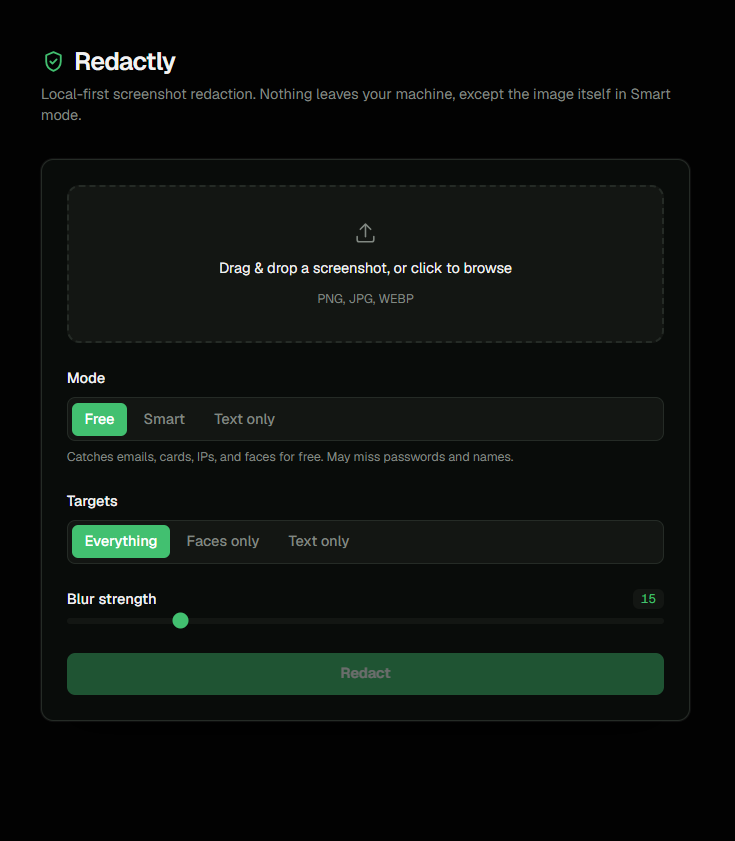
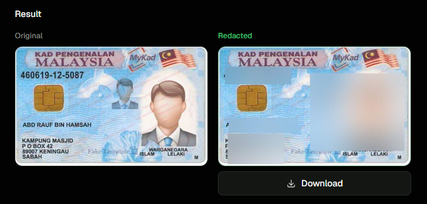

# Redactly

A local-first tool that finds and blurs sensitive information — emails, IC/ID
numbers, passwords, faces, and more — in screenshots.

## What it is

Redactly scans a screenshot, figures out which regions are sensitive, and
blurs them before you share the image. It's privacy-first by design: in the
default (free) mode, nothing leaves your machine — detection runs entirely on
local OCR, regex, and a local face detector. An optional `--smart` mode can
call Google Gemini's vision API for the cases local detection can't handle
(passwords, full names, hard-to-read IDs), but that's opt-in, not the default.

Available as a CLI for single images or whole folders, and as a small web app
(FastAPI backend + Next.js frontend) for interactive use.

## Screenshots



*The web UI: drag-and-drop upload, mode/target/blur controls, before-and-after result.*



*An ID card screenshot before and after redaction — face and printed ID text blurred.*

## Features

- **Dual detection**: OCR + regex catches structured data (emails, credit
  cards, IPs, IC numbers, API-key-shaped tokens); a local YuNet face detector
  (OpenCV) catches faces; Gemini vision handles contextual or hard-to-parse
  cases regex and OCR miss.
- **Three tiers**: Free (OCR + regex + faces, fully local), Smart (adds
  Gemini vision), Text-only (OCR + regex only, skips faces too).
- **Category targeting**: blur everything, faces only, or text only.
- **Adjustable blur strength.**
- **Batch/folder mode**: redact every image in a directory in one run, with
  per-file progress and failure isolation — one bad file doesn't abort the batch.
- **Dry-run mode**: see what would be redacted without writing any file.
- **Graceful degradation**: if Gemini fails or is skipped, the rest of the
  pipeline still runs, and the output tells you plainly what may be incomplete
  rather than failing silently.
- **CLI and web UI**, both driven by the same underlying pipeline.

## How it works

```
image → preprocess → OCR + Gemini vision detection → classify → pad/merge boxes → blur → safe copy
```

1. **Preprocessing** upscales and cleans up small or low-contrast images
   before OCR, since OCR accuracy on raw screenshots varies a lot.
2. **Detection** runs OCR twice — on the raw image and the preprocessed one —
   since preprocessing sometimes garbles text (e.g. drops a character) that a
   raw read gets right, and vice versa. Local face detection and, in Smart
   mode, Gemini vision run alongside it.
3. **Classification** filters OCR text through regex patterns for
   high-confidence sensitive formats.
4. Detected boxes are **padded and merged** so overlapping or adjacent
   detections don't produce double blurs or seams.
5. Matching regions are **blurred** and the result is saved as a separate file
   — the original is never modified.

The tiering is deliberate: local detection (OCR/regex/faces) is free and has
no rate limit, so it's the default. Gemini is a genuine upgrade in coverage —
it catches things regex fundamentally can't, like a password visible next to
a "Password" label — but it costs quota and can fail or rate-limit, so it's
an explicit opt-in (`--smart`) rather than something the tool depends on.

## Tech stack

**Backend**: Python, pytesseract + Tesseract OCR, Pillow, OpenCV (YuNet face
detection), FastAPI, Google Gemini (`google-genai`).

**Frontend**: Next.js, TypeScript, Tailwind CSS.

## Setup

### Prerequisites

- Python 3
- Node.js (for the web UI)
- Tesseract OCR engine:
  - **Windows**: install from the [Tesseract installer](https://github.com/UB-Mannheim/tesseract/wiki); the default install path is picked up automatically.
  - **macOS**: `brew install tesseract`
  - **Linux**: `sudo apt install tesseract-ocr` (Debian/Ubuntu) or your distro's equivalent

### Backend

```bash
python -m venv venv
source venv/bin/activate        # Windows: venv\Scripts\activate
pip install -r requirements.txt
```

`--smart` mode requires a Gemini API key. Copy `.env.example` to `.env` and
fill in `GEMINI_API_KEY`. This is optional — free and text-only modes work
with no key at all.

### Frontend

```bash
cd frontend
npm install
```

## Usage

### CLI

```bash
# Single image, default (free) mode
python main.py samples/screenshot.png

# Whole folder
python main.py samples/ --output redacted/

# Smart mode (adds Gemini vision)
python main.py screenshot.png --smart

# Text only — no face detection, no Gemini
python main.py screenshot.png --no-vision

# Only blur faces
python main.py screenshot.png --targets faces

# Custom blur strength
python main.py screenshot.png --blur 30

# Preview what would be redacted, without writing a file
python main.py screenshot.png --dry-run
```

### Web app

```bash
# Backend
uvicorn api:app --reload

# Frontend (separate terminal)
cd frontend
npm run dev
```

Open `http://localhost:3000`.

## Modes

| Mode | What it catches | Cost |
|---|---|---|
| **Free** (default) | Emails, credit cards, IPs, IC numbers, API-key-shaped tokens, faces | Local, unlimited |
| **Smart** (`--smart`) | Everything Free catches, plus passwords, full names, and hard-to-read IDs via Gemini vision | Uses Gemini API quota |
| **Text-only** (`--no-vision`) | Emails, credit cards, IPs, IC numbers, API-key-shaped tokens — no face detection | Local, unlimited |

## Limitations

These are known tradeoffs, not bugs:

- OCR can miss stylized fonts, very low-resolution text, or text overlaid on
  busy backgrounds (e.g. numbers printed over a hologram).
- The local face detector may miss faint, small, or partially obscured
  secondary faces, even though it's tuned toward higher recall.
- Gemini's password/credential detection is a strong improvement over regex
  alone, but it's a model judgment call, not a guarantee — it isn't 100%.
- Smart mode requires a Gemini API key and is subject to that API's rate
  limits; free-tier quota can be exhausted with moderate use.

Review redacted output before sharing it, especially in free/text-only mode.

## Experimental: agent mode

`--agent` routes a single image through an alternative pipeline where Gemini
itself decides which tools to call (OCR, regex check, vision detection, blur)
and in what order, instead of following the fixed pipeline above. It's
functional but experimental — the fixed pipeline is the recommended default.
